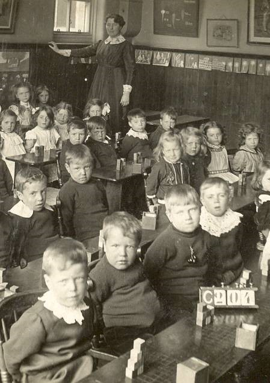

# Today

.pull-left[

## 10:00 - 12:00

- .large[R Project Management : 10 tips]
- .large[Questions & Discussion]
- .large[Demo: *git* version control]
  - .medium[clone / commit / push /pull]
  - .medium[branches / conflicts]
  - .medium[bitbucket issues]
- .large[Questions, Discussion, Homework]
]

.pull-right[

  
]

---

# Homework

.pull-left[

  
]

.pull-right[

  - Practice collaborating in groups of 2 - 3
    - clone / commit / push / pull / conflicts / branches
    - you can use a **fork** of the example project
    
  - Project management:
    1. organize your work into a logical folder structure
    2. clean up: make sure there is no code you don't use
    3. organize settings / configuration in a YAML file
    
]

