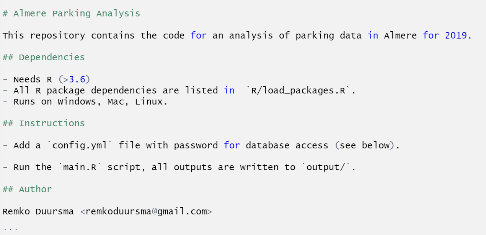

<style>
.smaller{
	font-size: 10px;
	padding: 2px;
}
.mediumsmall{
  font-size: 15px;
}

</style>


## Ten things any *good* R project should be:

> 1. **Reproducible** : the analysis can be carried out on another machine / later / by someone else
> 2. **Documented**: how do we run the analysis? what are inputs/outputs?
> 3. **Well-structured** : main scripts / other code / data / output / settings / documentation
> 4. **Clean** : throw away things you don't need
> 5. **Modular** : use functions as much as possible to structure your work, and avoid duplication
> 6. **Time-saving** : use a simple cache, or a workflow manager for slow steps
> 7. **Configurable** : collect configuration settings in a separate file
> 8. **Versioned**: use *git* version control for every single project (no exceptions)
> 9. **Well-named** : use clear *names* for things (functions, objects, files and folders)
> 10. **Small** : often, a single project becomes too large to manage well


## Reproducible research

A project can be run by another user* on another computer on a different OS

> 1. **Platform**. Does the project run only on Windows?
> 2. **Software** Except R, do we need other software? Beware: some packages have system dependencies (especially on Linux)!
> 3. **R Packages**. Did you keep R package dependencies to a minimum? Are all packages hosted on CRAN? Do you need specific versions?
> 4. Do we need passwords or other **configuration** to run the project, not included in version control?
> 5. For advanced usage: strongly consider using **docker** for reproducible projects ([see here](https://ropenscilabs.github.io/r-docker-tutorial/)).

'* <span style="font-size:0.8em;">This could be you, in the future</span>

## Documentation


Comments in the code are nice, but also write a `README.md` for each project:

  


```{r, eval = FALSE, include=FALSE}

# Almere Parking Analysis

This repository contains the code for an analysis of parking data in Almere for 2019.

## Dependencies

- Needs R (>3.6)
- All R package dependencies are listed in  `R/load_packages.R`.
- Runs on Windows, Mac, Linux.

## Instructions

- Add a `config.yml` file with password for database access (see below).

- Run the `main.R` script, all outputs are written to `output/`.

## Author

Remko Duursma <remkoduursma@gmail.com>

```

## Folder structure

When it comes to organizing the various files in your project, you have options.
But it is important to:

- Keep *code*, *data*, and *outputs* separate at all times. 

A (very!) minimal example:

  


In this example, we have a main script (`analysis.R`), which runs the analysis. 
All other files are collected in sub-folders.


## Working with folders in R


Never use full paths to files, for example:

```{r, eval=FALSE}
# Don't do this.
# It breaks our idea of reproducibility:
# this folder does not exist on another machine.
mydata <- read.csv("c:/users/remko/project1/data/bestand1.csv")
```

Use the *relative* path to access files:

```{r, eval=FALSE}
mydata <- read.csv("rawdata/bestand1.csv")
```

Remember that with **Rstudio projects**, the default working directory is the location of the `myproject.Rproj` file.


## Main script

Break large scripts into many smaller ones, each with its own task.
Scripts can be called using `source`.

```{r eval=FALSE}
# Load packages
source("R/load_packages")

# Load my custom function definitions.
source("R/functions.R")

# Configuration file
conf <- yaml::read_yaml("passwords.yml")

# Read raw data
main_data <- read_raw_data(conf)

# Make figures
source("R/make_figures.R")
```

From the command line, you can run an R script with `Rscript somescript.R` !


## Keep your room clean


- Delete files you no longer need from your project, perhaps collect them in some backup or archive.

- The idea of a reusable project is to have a *small*, *portable*, project without a history of how things were.

- Using *git*, you can always find files you deleted some time ago:

```
git log -G lostfunction
```

Using this command, we find all lines where `lostfunction` occurs. The last time it occurred is when you deleted that line!


## Modularity: write functions

Which outputs are based on which inputs?

```{r eval=FALSE}
# Read configuration file
.conf <- yaml::read_yaml("config.yml")

# Download raw data
almere_parking_raw <- download_almere_parking_data(.conf)

# Clean data
almere_parking <- clean_almere_data(almere_parking_raw)

# Make figure 1.
to.pdf(
  figure1(data = almere_parking), 
  filename = "output/figure1.pdf"
)

```


## Functions help to keep memory clean

We wrote this function to read raw data from a database connection:

```{r}
download_almere_parking_data <- function(conf){
  
  passw <- conf$password
  
  db <- dbConnect(database = "db.almere.nl",
                       password = passw)
  
  data <- dbReadTable(db, "almere_parking_current")
  
  dbDisconnect(db)
  
return(data)
}
```


## Functions help to keep memory clean (2)


Now we call this function from another script:

```{r eval=FALSE}
almere_parking_raw <- download_almere_parking_data(.conf)
```

Now, the objects `passw`, `db` and `data` are **not** available in the global environment. These objects only exist during function execution.


## Functions help to keep memory clean (3)

By not cluttering the global environment with objects we do not need, we avoid:

- **Conflicts** : I use `data` here as a name for a dataset inside a function. This is fine, since it cannot cause problems outside the function.
- **Leakage** of sensitive information (since we briefly stored the password in the object `passw`)
- **Excessive memory use** : large objects that we only need briefly won't take up any memory after the function is complete


## Use a simple cache for slow steps

- Often one or more steps in an analysis are time-consuming. We rather skip these steps unless we need to re-run them.

- Never use the Rstudio setting `Tools/Global Options/General/Workspace` to automatically load old objects into memory.

- When saving copies for re-use, always use `.rds` files (`saveRDS` / `readRDS`). These are exact copies of the R object.

- A good first step is to write your own basic caching system (next slide).

- Or take a look at `drake`, an advanced but easy to use system to define a workflow, and only re-run steps when needed (see example project).


## Use a simple cache for slow steps (2)


```{r eval = FALSE}

slow_process <- function(){
  # A slow function, or one that does not always work.
  # e.g. database access
}

fn <- "cache/slow_object.rds"

if(!file.exists(fn)){
  slow_object <- slow_process()
  saveRDS(slow_object, fn)
} else {
  slow_object <- readRDS(fn)
}

```

A most simple approach. Remove all files from `cache/` if you want to redo the slow step.


## Save configuration in a separate file

It is often useful to collect settings that a user may want to adjust in a separate configuration file (passwords, colors, figures to include, paths to data, etc.).

I prefer YAML files:


```
database:
  user: remkoduursma
  password: 123hello123
  table: almere_parking

colors:
  barplot: ["red","green","blue"]

```


## Save configuration in a separate file (2)


Save this file as e.g. `config.yml`, and read it with:

```
.conf <- yaml::read_yaml("config.yml")
```

We now read the settings as a nested list, for example `.conf$database$table`.


## Name everything (well)

It is really important to name everything carefully, to end up with readable scripts:

**Don't** do this:

- Very general names (`data`, `summary`, `dataset`)
- Very short names (`d`, `y`, `y2`)
- Using special characters (use only letters, numbers, and  `_`)

**Do** this:

- For all objects and functions you write, use *snake_case*

`read_almere_parking_data`, `convert_date_to_time`, `to_sql_string`, `figure1`

- Use descriptive names, making clear what the object does or represents.


## Name everything (well) (2)

The previous rules are for anything that ends up in the global environment, and is reused in your scripts.

Inside **functions** we have different rules: here it is very advantageous to have very general names (and use conventions).

```{r eval=FALSE}
append_database_row <- function(data, connection){
  
  dbWriteTable(connection, data, append = TRUE)
  
}
```

Because this function is very general, argument names like `data` and `connection` are not just OK - they are preferred. Take a look at built-in functions in R to learn what are typical names for arguments.


## Use git version control

Basic skills:

1. clone
2. stage
3. commit
4. push
5. pull

Extra skills:

1. branches
2. merging conflicts


## git branches


## git branches

> 1. *branches* are used in all more complex projects with multiple collaborators
> 2. But, also in projects with a single developer they are very useful!
> 3. Suppose you are working on your code base, and want to try out some experimental feature, but not break your `master` code (the working version).
> 4. Make a branch of your code: this is first an exact copy of your `master` "branch".
> 5. You can now make changes, commit and push as usual. All code changes are kept on your new branch onl.
> 6. Now, perhaps you want to replace the master code with your `newbranch`.


